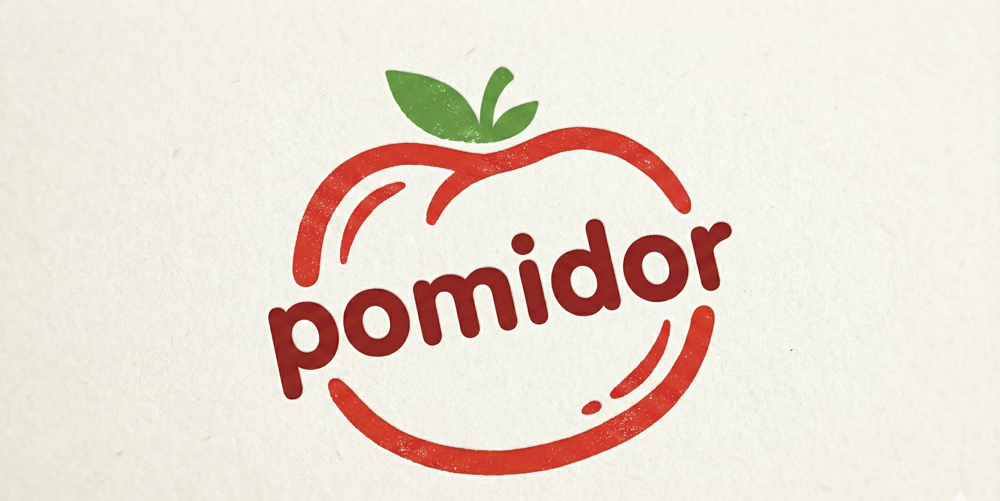

# 🍅 Pomidor — Помидор

**Own your time, own your data.**

> A bilingual (English / Русский) privacy-first productivity suite built with vanilla JavaScript. Pomodoro timer, task management, calendar visualization, statistics, gamification — and a future roadmap toward Google Calendar read-only integration so you can **own your calendar data**.

[](LICENSE)
[](CONTRIBUTING.md)
[](#tech-stack)

<p align="center">
  
</p>

---

## Why Pomidor?

"Pomodoro" is Italian for tomato. **"Pomidor" (Помидор)** is Russian for tomato. Same technique, fresh identity — with a mission:

- **Privacy-first** — All data stays in your browser (localStorage). No accounts, no cloud dependency. The hosted GitHub Pages version includes Google Analytics for usage insights; running locally has no tracking.
- **Offline-capable** — Full PWA with service worker. Install it, use it anywhere.
- **Bilingual** — English + Russian from day one. More languages welcome via contributions.
- **Calendar ownership** — Roadmap includes read-only Google Calendar integration so you can visualize and own your schedule data without giving write access to any third party.
- **Zero dependencies** — Pure vanilla JavaScript. No React, no Vue, no build step. Just open `index.html`.

---

## Features

### Core Productivity

- ⏲️ **Pomodoro Timer** — Session/break cycles with configurable durations (25/5, 50/10, 90/20, or custom)
- ✅ **Task Management** — Multiple lists, priorities (High/Medium/Low), due dates, pomodoro estimates, drag-and-drop reordering
- 📅 **Calendar** — Month & week views, day modals, quick-add tasks, date picker, activity heatmap
- 📊 **Statistics** — Daily goals, streaks, weekly trends, focus time totals, productivity insights, GitHub-style activity heatmap

### User Experience

- 🌙 **Dark / Light Mode** — System preference detection + manual toggle
- 🎨 **4 Themes** — Modern (glassmorphism), Legal Pad, Midnight, Ocean
- 🌍 **Bilingual** — English & Russian with `data-i18n` attribute system + extensible module
- ⚡ **Focus Mode** — Fullscreen distraction-free timer with 5 animation styles (particles, zen ripples, orbiting dots, breathing glow, progress arc)
- 🖱️ **Modern Timer** — Alternative centered timer UI alongside classic side-by-side view
- ⌨️ **Keyboard Shortcuts** — Space (play/pause), R (reset), F (focus), ? (help), V (view toggle)
- 🎯 **Drag & Drop** — Reorder tasks between lists or to archive

### Gamification

- 🏆 **13 Achievements** — Badges for milestones (First Steps, Centurion, Week Warrior, Month Master, Night Owl, Perfect Week, and more)
- 🎉 **Celebrations** — Confetti on daily goals, animations on task completion, streak fire effects
- 📈 **Streak Tracking** — Daily consistency motivation with best-streak records

### Technical

- 📱 **PWA** — Installable on any device, works offline, service worker caching
- 🔔 **Browser Notifications** — Timer completion alerts
- 📂 **Data Export/Import** — Full JSON backup/restore of all user data
- 🔊 **Configurable Audio** — Volume control with persistent preferences
- 🧩 **Web Components** — Custom `<progress-ring>` and `<hour-glass>` elements
- 🎨 **CSS Custom Properties** — Complete design token system with 50+ variables

---

## Quick Start

```bash
# Clone the repo
git clone https://github.com/YOUR_USERNAME/pomidor.git
cd pomidor

# That's it — no build step needed!
# Open index.html in your browser, or:
npx serve .
```

Or install the PWA from any deployed instance.

---

## Tech Stack

| Layer      | Technology                                  |
| ---------- | ------------------------------------------- |
| Language   | Vanilla JavaScript (ES Modules)             |
| Styling    | CSS3 with Custom Properties (design tokens) |
| Components | Web Components (Custom Elements)            |
| Storage    | localStorage (privacy-first, no server)     |
| PWA        | Service Worker, Web App Manifest            |
| Icons      | Font Awesome 5                              |
| Fonts      | Happy Monkey, Caveat (Google Fonts)         |
| Build      | None — zero tooling, zero dependencies      |

---

## Architecture

```
pomidor/
├── index.html              # Single-page application
├── manifest.json           # PWA manifest
├── sw.js                   # Service worker (stale-while-revalidate)
├── css/
│   ├── variables.css       # Design tokens (50+ CSS custom properties)
│   ├── styles.css          # All component styles (~7,800 lines)
│   └── futureVars.css      # Extended theme variables
├── js/
│   ├── app.js              # Entry point — module orchestrator
│   ├── modules/
│   │   ├── i18n.js         # Internationalization (EN/RU)
│   │   ├── timer.js        # Core timing engine
│   │   ├── pomodoro.js     # Bootstrap & initialization
│   │   ├── todo.js         # Task CRUD, filtering, sorting
│   │   ├── calendar.js     # Month/week views, day modals
│   │   ├── stats.js        # Analytics, heatmap, streaks
│   │   ├── achievements.js # Badge unlock system
│   │   ├── focusMode.js    # Fullscreen distraction-free mode
│   │   ├── modernTimer.js  # Alternative timer UI
│   │   ├── theme.js        # Dark/light mode
│   │   ├── settings.js     # User preferences
│   │   ├── keyboard.js     # Shortcut handler
│   │   └── ...             # 7 more utility modules
│   ├── components/
│   │   ├── progress-ring.js # SVG progress ring web component
│   │   └── hour-glass.js   # SVG hourglass web component
│   └── utils/
│       └── todoDragDrop.js # Drag and drop logic
├── icons/
│   ├── brand/              # Brand images (EN/RU, WebP/PNG/SVG)
│   └── icon-*.png          # PWA icons (72-512px)
└── audio/
    └── buzzer.mp3          # Timer completion sound
```

**18+ JavaScript modules**, **2 web components**, **4 themes**, **13 achievements**, **50+ CSS design tokens** — all in zero-dependency vanilla JS.

---

## Roadmap

See [ROADMAP.md](ROADMAP.md) for the full plan. Key upcoming milestones:

### v2.0 — Calendar Ownership (Next)

- 📅 Read-only Google Calendar integration (OAuth2, read scope only)
- 📤 Calendar data export (ICS, JSON)
- 🔄 Sync visualization — see your Google Calendar events alongside Pomidor tasks
- 🚫 **No write access** — your calendar, your control

### v2.1 — Community & i18n

- 🌍 Community-contributed translations (framework ready)
- 📝 Contributing guide and translation guide
- 🧪 Test suite (Playwright + unit tests)

### v3.0 — Data Sovereignty

- 📊 Local analytics dashboard (no third-party analytics)
- 🔐 Optional encrypted local backup
- 📱 Mobile-optimized responsive overhaul

---

## Contributing

Contributions welcome! Whether it's:

- 🌍 **Translations** — Add your language to `js/modules/i18n.js`
- 🐛 **Bug fixes** — Check the [issues](../../issues)
- ✨ **Features** — See [ROADMAP.md](ROADMAP.md) for planned work
- 📖 **Documentation** — Improve guides, add examples
- 🎨 **Themes** — Create new app themes

### Adding a Language

1. Open `js/modules/i18n.js`
2. Copy the `en` translation object
3. Add your language code and translate the strings
4. Submit a PR!

---

## License

MIT — see [LICENSE](LICENSE) for details.

---

<p align="center">
  Made with 🍅 by open source contributors<br/>
  <em>Сделано с 🍅 участниками с открытым кодом</em>
</p>
