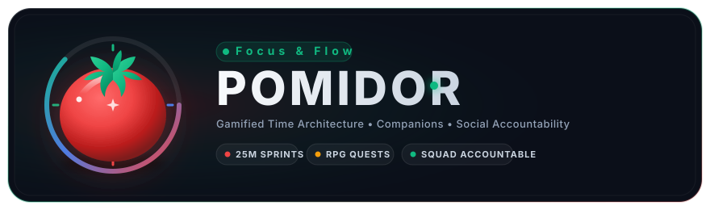

# 🍅 Pomidor — Помидор

**Own your time, own your data, master your focus.**

> A privacy-first, multi-tenant productivity & tactical focus suite built with vanilla JavaScript. Pomodoro timer, task management, calendar visualization, deep statistics, mascot companions, tactics RPG focus battles, accountability squads, and an administrative telemetry studio.

[](LICENSE)
[](CONTRIBUTING.md)
[](#tech-stack)

<p align="center">
  
</p>

---

## Why Pomidor?

"Pomodoro" is Italian for tomato. **"Pomidor" (Помидор)** is Russian for tomato. Same technique, fresh identity — with a mission:

- **Privacy-First & Multi-Tenant Data Partitioning** — All tenant state is isolated in client-side storage partitions (`pomidor.tenant.<id>`). Zero mandatory backend, zero tracking requirements, hot-swappable user contexts.
- **Offline-Capable PWA** — Service worker caching with automatic background asset hydration and offline-first reliability.
- **Bilingual Core** — English & Russian natively supported across the entire interface and branding.
- **Zero Dependencies** — Built completely with Vanilla ES Modules, native Web Components, and CSS custom properties. No npm build steps, no heavy frameworks.
- **Accountability & Gamification** — Focus rooms, buddy squads, high-fives, and a full turn-based Tactics RPG engine powered by your real-world focus sessions.
- **Enterprise-Grade Admin & Telemetry** — Real-time performance monitoring, client-side bot detection, GA4 event pipelines, and partition directory inspection.

---

## Key Features

### ⏲️ Core Productivity & Focus
- **Chrono Pomodoro Timer** — 25/5, 50/10, 90/20 presets or custom cycles with ambient audio chimes.
- **Interactive Focus Mode** — Fullscreen distraction-free timer with Zen ripples, breathing glows, particles, and progress arcs.
- **Task & Vault Management** — Hierarchical task lists, priorities (High/Med/Low), estimates, drag-and-drop ordering, and markdown notes.
- **Interactive Calendar & Heatmap** — Month & week views, quick-add task modals, and GitHub-style activity heatmaps.
- **Deep Analytics** — Daily streaks, focus time distributions, productivity velocity charts, and 13 unlockable achievements.

### 👥 Multi-Tenant Persona Partitioning & Accountability
- **Default Onboarding Persona** — New sessions launch immediately into `tenant_novice` ("You", Focus Apprentice) with curated starter tasks and onboarding guidance.
- **Preloaded Rich Personas** — Hot-swap between 6 distinct tenant profiles, each with independent tasks, habits, vault notes, and RPG gear:
  1. `tenant_novice` — You (Focus Apprentice / Pomi Mascot / Level 1)
  2. `tenant_admin` — Shug (Chief Architect & Admin / Level 25)
  3. `tenant_elena` — Elena Rostova (Staff Distributed Systems Engineer / Caly / Level 38)
  4. `tenant_darius` — Dr. Darius Vance (Neuro-Performance Specialist / Spike / Level 42)
  5. `tenant_aiko` — Aiko Tanaka (Design Systems Director / Flora / Level 29)
  6. `tenant_leo` — Leo Morales (Solo Bootstrapped Founder / Bolt / Level 19)
- **Accountability Lounge** — Virtual co-working focus chambers (*Deep Work Chamber*, *Algorithm Workshop*, *Design Sprint Lab*, *Night Owl Sprint*), buddy squad cards, one-click High-Fives, gentle nudges, and live activity streams.
- **Granular Privacy Matrix** — Toggle public visibility for focus time, streaks, active rooms, and tactical levels per tenant.

### 🛡️ Admin Telemetry Studio & Command Center
- **Partition Directory** — Live health check of all client storage partitions with one-click impersonation.
- **Real-Time Telemetry** — Live framerate (FPS), memory footprint heap gauges, and interaction latency tracking.
- **Client-Side Bot & Threat Detection** — Automated heuristic scoring for headless Chrome, WebDriver flags, automation plugins, and synthetic mouse trajectories.
- **GA4 Analytics Pipeline** — Testable measurement protocol events with custom event dispatchers.

### ⚔️ Tactics RPG & Mascot Companions
- **Tactics Battle Arena** — 7x7 grid turn-based tactical combat. Earn Action Points (AP) and focus mana through real-world pomodoro intervals.
- **Chronomancy Dungeons** — Explore the Chrono Tower, unlock dungeon floors, and equip legendary artifacts.
- **Mascot Companions** — Choose from Pomi (Tomato), Caly (Calculator), Spike (Focus Cactus), Flora (Bloom Orchid), Bolt (Lightning Spark), or Sage (Owl). Mascots guide tours, celebrate milestones, and cheer focus sessions.
- **Guided Interactive Tours** — Step-by-step spotlights navigating core tools, timer mechanics, and tactics battle arenas.

### 🎨 Design & Multi-Variant Branding
- **Cohesive Apple/Linear Aesthetic** — Frosted glassmorphism, fluid dark/light themes, concentric chrono rings, and modern typography.
- **Multi-Variant Brand Emblems** — 4 distinct vector styles (Sleek Modern, Soviet Constructivist, Edgy & Dark Tactical, and Lighthearted & Playful Kawaii) in both English and Russian SVGs. Includes a live 1-click in-app switcher in Hero Banner and Settings.
- **Cleaned-Up Messaging** — Grounded, unpretentious taglines (*"Focus & Flow"* / *"Фокус и Поток"*, *"Discipline & Labor"*, *"Locked In"*, *"One Tomato at a Time"*).
- **100% SVG Vector Architecture** — Strict zero-unicode-emoji policy across all views, replaced by bespoke scalable SVGs.

---

## Directory Architecture

```
pomidor/
├── index.html                      # Single-page application orchestrator
├── manifest.json                   # Progressive Web App manifest
├── sw.js                           # Service worker with offline caching
├── css/
│   ├── variables.css               # Design tokens & theme definitions
│   ├── styles.css                  # Core component and layout styling
│   └── futureVars.css              # Extended palette & typography variables
├── js/
│   ├── app.js                      # Application root & view switcher
│   ├── modules/
│   │   ├── timer.js                # High-precision timer engine
│   │   ├── todo.js                 # Task manager with drag-and-drop
│   │   ├── calendar.js             # Calendar views and day modals
│   │   ├── stats.js                # Focus analytics and heatmaps
│   │   ├── achievements.js         # Achievement unlock system
│   │   ├── focusMode.js            # Fullscreen zen focus experience
│   │   ├── telemetry.js            # Performance and event telemetry
│   │   ├── botDetection.js         # Heuristic bot and automation scanner
│   │   ├── social/
│   │   │   ├── profileCatalog.js   # 6 custom pre-seeded tenant datasets
│   │   │   ├── profileManager.js   # Multi-tenant partition controller
│   │   │   └── socialStudio.js     # Accountability Lounge UI & interactions
│   │   ├── admin/
│   │   │   └── adminStudio.js      # Admin Studio & telemetry command center
│   │   ├── mascot/
│   │   │   ├── mascotEngine.js     # Companion state machine & voice
│   │   │   └── mascotSvgs.js       # Bespoke mascot SVG vector renderer
│   │   ├── tactics/
│   │   │   ├── tacticsEngine.js    # 7x7 grid turn-based RPG battle engine
│   │   │   └── tacticsUi.js        # Combat grid & dungeon HUD
│   │   ├── tours/
│   │   │   └── tourGuide.js        # Interactive spotlight tour engine
│   │   └── i18n.js                 # Bilingual translation dictionaries (EN/RU)
│   ├── components/
│   │   ├── progress-ring.js        # Custom progress ring Web Component
│   │   └── hour-glass.js           # Custom animated hourglass Web Component
│   └── utils/                      # SVG icon library and helpers
├── icons/
│   ├── favicon.svg                 # Scalable modern vector favicon
│   ├── favicon.ico                 # Multi-size legacy desktop icon
│   ├── icon-*.png                  # PWA icons (72px - 512px)
│   ├── brand/
│   │   ├── pomidor_en.svg          # Modern English vector emblem
│   │   ├── помидор_ru.svg          # Modern Russian Cyrillic vector emblem
│   │   ├── variants/               # Modern, Soviet, Edgy, and Lighthearted SVGs (EN/RU)
│   │   └── legacy/                 # Archived original brand assets
│   └── legacy/                     # Archived original app icons
└── tests/                          # Playwright end-to-end test suite
    ├── social-and-admin.spec.js    # Multi-tenant & Admin Studio tests
    ├── telemetry-and-bot.spec.js   # Telemetry & bot detection tests
    ├── tactics-rpg-expansion.spec.js # Tactics RPG engine tests
    ├── mascot-tactics.spec.js      # Mascot & tour engine tests
    ├── localization-and-hero.spec.js # Bilingual & hero tests
    └── smoke.spec.js               # Core app smoke suite
```

---

## Getting Started

### Local Development
No npm build step is required! Simply serve the directory using any static web server:

```bash
# Clone the repository
git clone https://github.com/ShugKnight24/pomodoro.git
cd pomodoro

# Serve locally
npx serve .
# Open http://localhost:3000 in your browser
```

### Running Tests
Automated end-to-end tests are implemented using [Playwright](https://playwright.dev/):

```bash
# Install test dependencies (first time only)
npm install

# Run the complete test suite
npx playwright test

# Run a specific spec
npx playwright test tests/social-and-admin.spec.js
```

---

## Multi-Tenant Architecture & Privacy Guarantee

All data within Pomidor is stored client-side under partitioned keys:
- `pomidor.activeTenantId`: Identifies the current active tenant (`tenant_novice` by default).
- `pomidor.tenant.<id>`: Stores the isolated profile, tasks, habits, notes, achievements, and RPG progress for that specific tenant.
- **Zero Cloud Leakage**: Switching tenants swaps the active localStorage partition instantly in memory. No data is transmitted to remote databases without user consent.

---

## Contributing & Community

Contributions are welcome! Please feel free to open PRs or issues:
- 🌍 **Translations** — Extend `js/modules/i18n.js` with new language dictionaries.
- ⚔️ **Tactics RPG Content** — Add new enemies, skills, and gear in `js/modules/tactics/`.
- 🎨 **Visual Themes** — Contribute new CSS custom property themes to `css/variables.css`.

---

## License

Released under the [MIT License](LICENSE).

<p align="center">
  Crafted with precision focus 🍅<br/>
  <em>Создано с фокусировкой и любовью к деталям 🍅</em>
</p>
